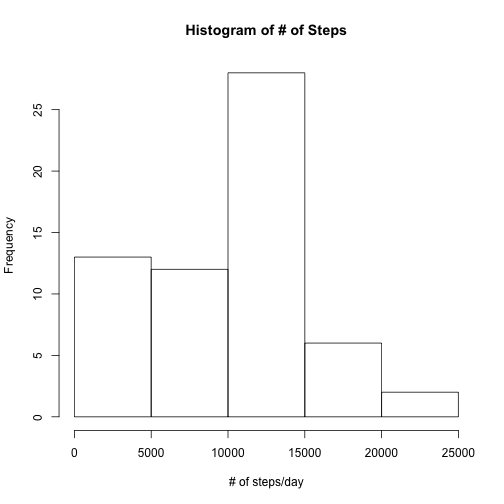
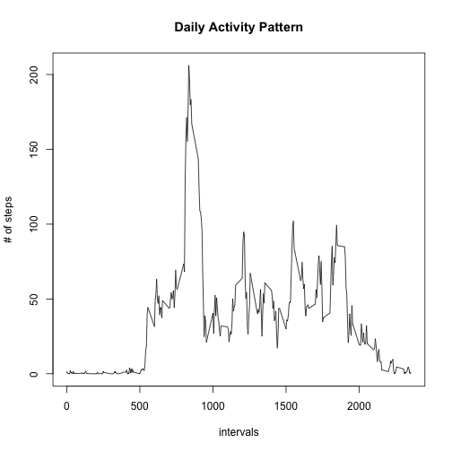
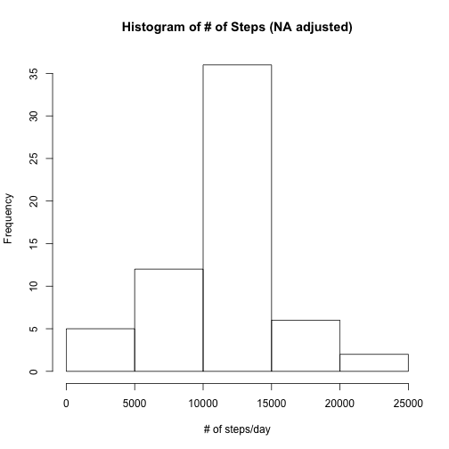

# Reproducible Research: Peer Assessment 1


## Loading and preprocessing the data

Read the data first


```r
setwd('/Users/xc/datasciencecoursera/RepData_PeerAssessment1')
unzip('./activity.zip')
my_data <- read.csv('./activity.csv', header = TRUE, sep = ',', comment.char = '', nrows = 17568)
head(my_data)
```

```
##   steps       date interval
## 1    NA 2012-10-01        0
## 2    NA 2012-10-01        5
## 3    NA 2012-10-01       10
## 4    NA 2012-10-01       15
## 5    NA 2012-10-01       20
## 6    NA 2012-10-01       25
```

We can see that the data is well formatted, and there is not much cleanning needed.

## What is mean total number of steps taken per day?


```r
x <- with(my_data, tapply(steps, date, sum, na.rm = TRUE, simplify = TRUE))
hist(x, xlab = '# of steps/day', main = 'Histogram of # of Steps')
```

 

```r
mean_x <- mean(x)
median_x <- median(x)
```

The mean total number of steps per day is 9354.2295, and the median of it is 10395.


## What is the average daily activity pattern?


```r
attach(my_data)
intervals <- as.factor(interval)
result <- tapply(steps, intervals, mean, na.rm = TRUE, simplify = TRUE)
plot(levels(intervals), result, type = 'l', main = 'Daily Activity Pattern', xlab = 'intervals', ylab = '# of steps')
```

 

```r
most_active <- names(which.max(result))
detach(my_data)
```

The most active interval is the 835th interval.

## Imputing missing values

Notice that in our dataset, NA only appears in the "steps" column.


```r
num_NA <- sum(is.na(my_data$steps))
```

There are 2304 missing values.
By checking previous result, we know that for every 5 minutes interval, there is at least one value, and the average acrossed all days is thus not NA. We will use that value to replace NA in the same 5 minutes interval. 


```r
replaceNA <- function(x, result){
  if(is.na(x[1])){
    index <- as.character(as.numeric(x[[3]]))
    return(result[[index]])
    }
  else
    return(x[[1]])
}
x <- apply(my_data, 1, replaceNA, result)
x <- as.numeric(x)
my_data2 <- my_data
my_data2$steps <- x
head(my_data2)
```

```
##     steps       date interval
## 1 1.71698 2012-10-01        0
## 2 0.33962 2012-10-01        5
## 3 0.13208 2012-10-01       10
## 4 0.15094 2012-10-01       15
## 5 0.07547 2012-10-01       20
## 6 2.09434 2012-10-01       25
```

```r
anyNA(my_data2)
```

```
## [1] FALSE
```

Plot the new data, which gives


```r
x <- with(my_data2, tapply(steps, date, sum, na.rm = TRUE, simplify = TRUE))
hist(x, xlab = '# of steps/day', main = 'Histogram of # of Steps (NA adjusted)')
```

 

```r
mean_x <- mean(x)
median_x <- median(x)
```

The mean is 1.0766 &times; 10<sup>4</sup>, and the median is 1.0766 &times; 10<sup>4</sup>.

We can see that imputing missing data on average increases the total daily number of steps.

## Are there differences in activity patterns between weekdays and weekends?

The following code basically first splits the data frame based on weekday or weekend, then uses tapply to get the requried mean, then assembles a new data frame which satisfies the input format of xyplot, then feeds it to xyplot.


```r
library(lattice)
temp <- as.Date(my_data2$date)
temp <- weekdays(temp)
temp <- as.factor(temp)
levels(temp) <- c('Weekday', 'Weekday', 'Weekend', 'Weekend', 'Weekday', 'Weekday', 'Weekday')
head(temp)
```

```
## [1] Weekday Weekday Weekday Weekday Weekday Weekday
## Levels: Weekday Weekend
```

```r
levels(temp)
```

```
## [1] "Weekday" "Weekend"
```

Variable 'temp' is the required factor variable, and we will use it to split the data.


```r
my_data2 <- split(my_data2, temp)
data_weekday <- my_data2[[1]]
data_weekend <- my_data2[[2]]
data_weekday$interval <- as.factor(data_weekday$interval)
data_weekend$interval <- as.factor(data_weekend$interval)
mean_weekday <- with(data_weekday, tapply(steps, interval, mean, simplify = TRUE))
mean_weekend <- with(data_weekend, tapply(steps, interval, mean, simplify = TRUE))
intervals <- as.numeric(names(mean_weekday))
mean_weekday <- as.numeric(mean_weekday)
mean_weekend <- as.numeric(mean_weekend)
mean_weekday <- cbind(mean_weekday, intervals)
mean_weekend <- cbind(mean_weekend, intervals)
date <- c(rep('weekend',288), rep('weekday',288))
my_data3 <- data.frame(rbind(mean_weekend, mean_weekday))
my_data3 <- cbind(my_data3, date)
names(my_data3) <- c('steps', 'intervals', 'date')
head(my_data3)
```

```
##      steps intervals    date
## 1 0.214623         0 weekend
## 2 0.042453         5 weekend
## 3 0.016509        10 weekend
## 4 0.018868        15 weekend
## 5 0.009434        20 weekend
## 6 3.511792        25 weekend
```

We then feed the above data frame 'my_data3' to xyplot.


```r
xyplot(steps ~ intervals | date, data = my_data3, type = 'l', layout = c(1, 2), xlab = 'Interval', ylab = 'Number of steps')
```

 
